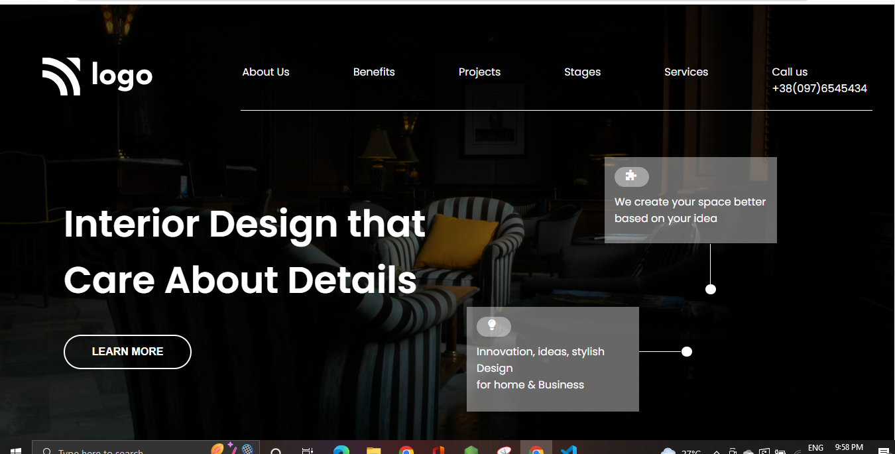

## Name- Anurag Pathak

## Hashnode link- [Markdown guide](https://img.shields.io/badge/project-developer%20landingpage-green)

# Developer landing page.
 In this Interior landing page project I used html and css.I learn more about position relative and others properties of css. Thanks to the Inueron team. 
# Skills.
* HTML
* CSS

# Time.
4 hours

# Learn from the project.
* Ids and classes
* Designing button
* positio-relative
* css colors

# Screenshot of project.

## Thanks to-

